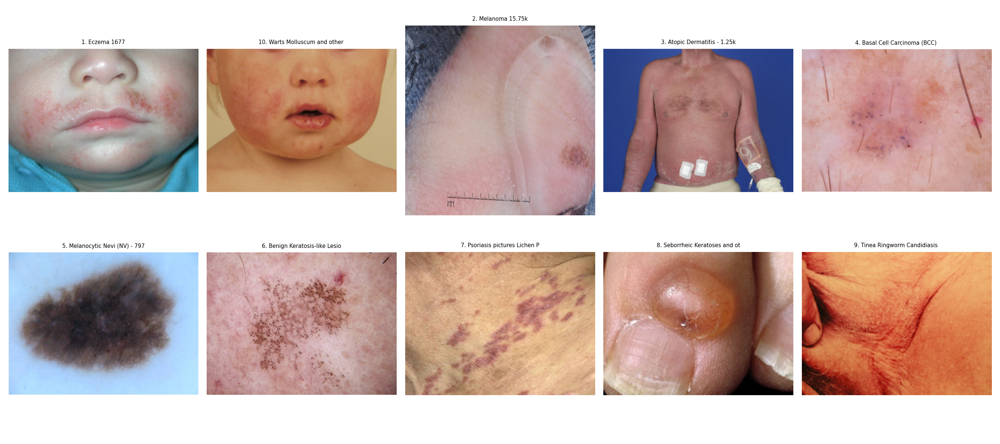
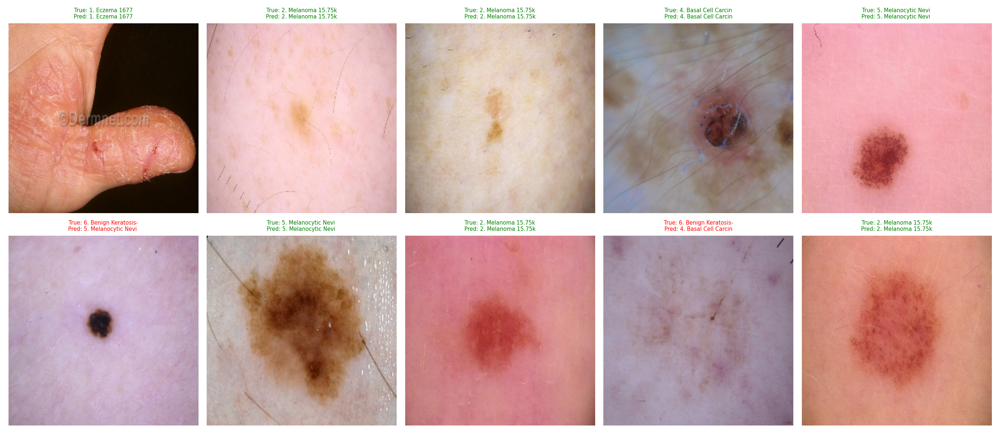

# Phân Loại Bệnh Ngoài Da với SwinT và QLoRA

<div align="center">

<!-- Banner / Screenshot placeholder -->


<br/>

**Dự án phân loại 10 nhóm bệnh ngoài da bằng Swin Transformer Tiny, fine-tune với QLoRA trên bộ dữ liệu Skin Diseases Image Dataset.**

<br/>


</div>

---

## 1. Project Title & Catchphrase

**Phân Loại Bệnh Ngoài Da với SwinT và QLoRA** là dự án phân loại ảnh da liễu vào 10 nhóm bệnh ngoài da phổ biến.

Dự án tập trung vào bài toán **multi-class image classification** với dữ liệu mất cân bằng, sử dụng **Swin Transformer Tiny** pretrained ImageNet và fine-tune bằng **QLoRA** để giảm số tham số cần huấn luyện.

> Dự án phục vụ mục đích học tập, nghiên cứu và demo AI. Kết quả dự đoán không thay thế chẩn đoán y khoa.

---

## 2. Quick Demo & Visuals

<div align="center">

[Streamlit Web Demo](#) ·
[Dataset Kaggle](https://www.kaggle.com/datasets/ismailpromus/skin-diseases-image-dataset) ·
[Source Code](#)

<br/><br/>



</div>


---

## 3. Tính Năng Nổi Bật

- **Phân loại 10 nhóm bệnh ngoài da:** hỗ trợ các nhóm bệnh lành tính và ác tính trong dataset Kaggle.
- **Fine-tune hiệu quả:** sử dụng QLoRA, chỉ train khoảng `0.77%` tham số của mô hình.
- **Xử lý mất cân bằng dữ liệu:** kết hợp `WeightedRandomSampler`, `Focal Loss` và class weights.
- **Augmentation mạnh:** dùng Albumentations với flip, rotate, brightness, contrast và CoarseDropout.
- **Demo Streamlit:** upload ảnh, chạy inference và hiển thị xác suất của toàn bộ 10 lớp.

---

## 4. Công Nghệ Sử Dụng

<div align="center">


</div>

### Thành phần kỹ thuật

| Nhóm | Công nghệ | Vai trò |
|---|---|---|
| Backbone | Swin Transformer Tiny | Trích xuất đặc trưng ảnh |
| Fine-tuning | QLoRA / PEFT | Giảm số tham số cần huấn luyện |
| Loss | Focal Loss + class weights | Hỗ trợ dữ liệu mất cân bằng |
| Sampling | WeightedRandomSampler | Cân bằng xác suất lấy mẫu giữa các lớp |
| Augmentation | Albumentations | Tăng độ đa dạng dữ liệu train |
| Evaluation | torchmetrics, scikit-learn | Tính Accuracy, Macro F1, Macro AUC, confusion matrix |
| Demo | Streamlit | Giao diện dự đoán ảnh da liễu |

---

## 5. Triển Khai Nhanh

**Prerequisites**

- Python 3.10+
- Windows 10/11
- NVIDIA GPU và CUDA driver nếu muốn train trên GPU
- Khuyến nghị VRAM từ 4GB trở lên
- Kaggle API token nếu muốn tải dataset bằng CLI

```bash
# Clone repository
git clone https://github.com/<username>/<repo-name>.git
cd SkinDisease_SwinT

# Tạo và kích hoạt môi trường ảo trên Windows
python -m venv venv
venv\Scripts\activate

# Cài PyTorch CUDA 12.6
pip install torch torchvision torchaudio --index-url https://download.pytorch.org/whl/cu126

# Cài thư viện phụ thuộc
pip install -r requirements/requirements.txt

# Cấu hình Kaggle API
# Đặt file kaggle.json vào requirements/kaggle.json
set KAGGLE_CONFIG_DIR=requirements

# Tải dataset từ Kaggle
kaggle datasets download -d ismailpromus/skin-diseases-image-dataset -p data --unzip

# Huấn luyện mô hình bằng notebook
# Mở notebooks/SkinDisease_SwinT.ipynb và chạy lần lượt các cell

# Chạy demo Streamlit
streamlit run streamlit_app/app.py
```

Sau khi chạy Streamlit, mở trình duyệt tại:

```text
http://localhost:8501
```

---

## 6. Tài Liệu Dự Án

### Bài toán

| Thành phần | Mô tả |
|---|---|
| Input | Ảnh da liễu |
| Output | Một trong 10 lớp bệnh ngoài da |
| Task | Multi-class classification |
| Vấn đề dữ liệu | Imbalanced dataset |
| Mô hình | Swin Transformer Tiny |
| Fine-tuning | QLoRA |
| Demo | Streamlit |

### Bộ dữ liệu

Nguồn dữ liệu: [Skin Diseases Image Dataset](https://www.kaggle.com/datasets/ismailpromus/skin-diseases-image-dataset)

| Hạng mục | Giá trị |
|---|---:|
| Tổng số ảnh | Khoảng 27.200 ảnh |
| Số lớp | 10 |
| Split | Train 80% / Val 10% / Test 10% |
| Kiểu split | Stratified |

### Danh sách lớp

| STT | Tên lớp | Số ảnh xấp xỉ |
|---:|---|---:|
| 1 | Chàm | 1.677 |
| 2 | Ung thư hắc tố | 15.750 |
| 3 | Viêm da dị ứng | 1.250 |
| 4 | Ung thư tế bào đáy | 3.323 |
| 5 | Nốt ruồi | 7.970 |
| 6 | Tổn thương sừng hóa lành tính | 2.624 |
| 7 | Vảy nến và địa y phẳng | 2.000 |
| 8 | Dày sừng tiết bã và u lành tính | 1.800 |
| 9 | Nấm da và hắc lào | 1.700 |
| 10 | Mụn cóc và nhiễm virus | 2.103 |

### Kiến trúc và chiến lược huấn luyện

| Thành phần | Cấu hình |
|---|---|
| Backbone | `swin_tiny_patch4_window7_224` |
| Pretrained | ImageNet |
| Fine-tune | QLoRA |
| Loss | Focal Loss với class weights |
| Optimizer | AdamW |
| Mixed precision | AMP |
| Xử lý mất cân bằng | WeightedRandomSampler + Focal Loss |
| Augmentation | Flip, rotate, brightness, contrast, CoarseDropout |
| Early stopping | Có, `patience = 5` |

### Siêu tham số

| Tham số | Giá trị |
|---|---:|
| `img_size` | 224 |
| `batch_size` | 32 |
| `epochs` | 50 |
| `lr_head` | 3e-4 |
| `lr_backbone` | 1e-5 |
| `weight_decay` | 1e-2 |
| `patience` | 5 |
| `lora_r` | 8 |
| `lora_alpha` | 16 |
| `lora_dropout` | 0.1 |
| `num_classes` | 10 |
| Tham số có thể train | 213.120 / 27.740.164 |
| Tỉ lệ tham số có thể train | 0.77% |

### Quy trình notebook

Notebook chính:

```text
notebooks/SkinDisease_SwinT.ipynb
```

| Cell | Nội dung |
|---:|---|
| 0 | Kiểm tra GPU |
| 1 | Import thư viện |
| 2 | Tải dataset từ Kaggle |
| 3 | Kiểm tra số lượng ảnh từng class |
| 4 | EDA: phân bố lớp, ảnh đại diện, kích thước ảnh |
| 5 | Tiền xử lý và chia dữ liệu |
| 6 | Cấu hình siêu tham số |
| 7 | Xây dựng mô hình SwinT + QLoRA |
| 8 | Huấn luyện với AMP |
| 9 | Vẽ loss, accuracy, F1, AUC |
| 10 | Đánh giá trên tập test |
| 11 | Hiển thị 10 ảnh dự đoán ngẫu nhiên |
| 12 | Xuất file Streamlit app |

### Kết quả

Kết quả đánh giá trên tập test khoảng 2.716 ảnh:

| Chỉ số | Giá trị |
|---|---:|
| Accuracy | 76.8% |
| Macro F1 | 75.0% |
| Macro AUC | 98.3% |
| Val Loss tốt nhất | 0.2518 |
| Early stopping | Epoch 28 |

> Kết quả có thể thay đổi theo seed, môi trường chạy, cách chia dữ liệu, batch size và cấu hình augmentation.

### Vị trí kết quả

| Kết quả | Đường dẫn |
|---|---|
| Mô hình tốt nhất | `models/best_swint_skin.pth` |
| Biểu đồ phân bố class | `logs/class_distribution.png` |
| Ảnh đại diện từng class | `logs/sample_images.png` |
| Biểu đồ kích thước ảnh | `logs/size_distribution.png` |
| Biểu đồ huấn luyện | `logs/training_curves.png` |
| Confusion matrix | `logs/confusion_matrix.png` |
| Ảnh dự đoán mẫu | `logs/test_predictions.png` |

### Demo Streamlit

Tính năng chính:

- Tải ảnh từ máy tính với định dạng `.jpg`, `.jpeg`, `.png`, `.bmp`, `.webp`.
- Hiển thị ảnh gốc đầy đủ ngữ cảnh.
- Chạy inference trên GPU hoặc CPU.
- Hiển thị tên bệnh dự đoán và độ tin cậy.
- Hiển thị xác suất của toàn bộ 10 lớp.
- Vẽ biểu đồ cột ngang xác suất từng lớp.

Lệnh chạy demo theo đường dẫn local mẫu:

```bash
cd "D:\Documents\HK2 2025-26 KHDL (Y3) Ky 6\Đồ án CN\SkinDisease_SwinT"
venv\Scripts\activate
streamlit run streamlit_app/app.py
```

### Cấu trúc dự án

```text
SkinDisease_SwinT/
├── data/                          # Dataset, không đẩy lên GitHub
│   └── IMG_CLASSES/
│       ├── 1. Eczema 1677/
│       ├── 2. Melanoma 15.75k/
│       └── ...
├── models/                        # Model đã huấn luyện, không đẩy lên GitHub
│   └── best_swint_skin.pth
├── notebooks/
│   └── SkinDisease_SwinT.ipynb
├── logs/
│   ├── class_distribution.png
│   ├── sample_images.png
│   ├── size_distribution.png
│   ├── training_curves.png
│   ├── confusion_matrix.png
│   └── test_predictions.png
├── predictions/
├── streamlit_app/
│   └── app.py
├── requirements/
│   ├── kaggle.json               # Không đẩy lên GitHub
│   └── requirements.txt
├── .gitignore
└── README.md
```

### Git ignore khuyến nghị

```text
venv/
data/
models/
requirements/kaggle.json
__pycache__/
.ipynb_checkpoints/
*.pyc
*.pth
*.h5
```

### Push lên GitHub

```bash
# Khởi tạo Git
git init
git add .
git commit -m "Initial commit: SkinDisease SwinT QLoRA"

# Kết nối remote
git remote add origin https://github.com/<username>/<repo-name>.git
git branch -M main

# Push code
git push -u origin main
```

### Lưu ý sử dụng

- Không commit dataset, model weights hoặc Kaggle API token lên GitHub.
- File `requirements/kaggle.json` cần được giữ riêng tư.
- Nếu chia sẻ demo, cần đảm bảo app trỏ đúng đường dẫn `models/best_swint_skin.pth`.
- Dự án chỉ phục vụ học tập và nghiên cứu, không dùng để tự chẩn đoán hoặc thay thế tư vấn y tế.

### Author

**franceto (ANH PHAP TO)**  
GitHub: [https://github.com/franceto](https://github.com/franceto)

### Support

Nếu project hữu ích, hãy cho repository một sao.

Made by **Franceto (ANH PHAP TO)**
