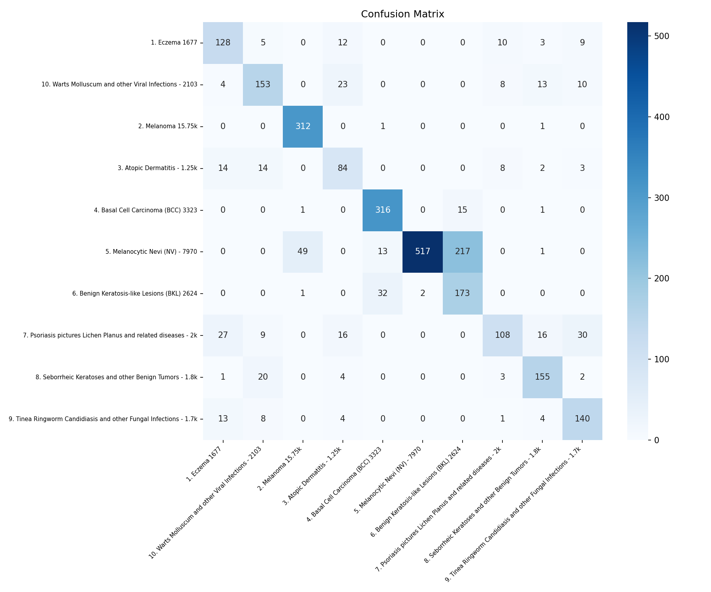
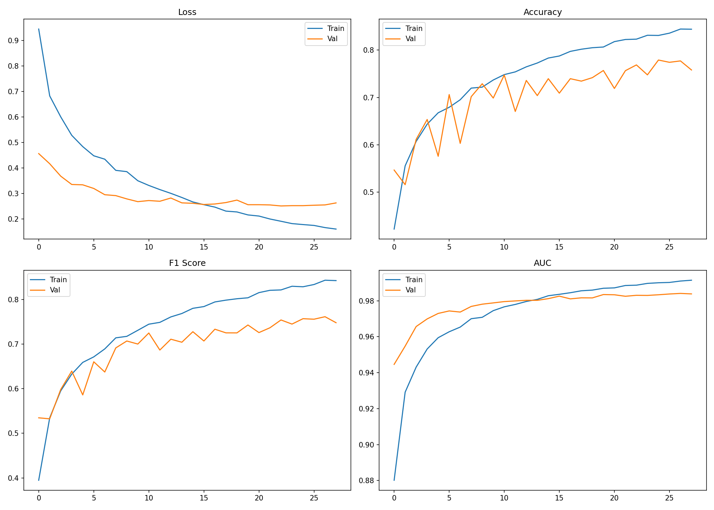

# Phan Loai Benh Ngoai Da voi SwinT va QLoRA

<div align="center">

<!-- Banner / Screenshot placeholder -->


<br/>

**Du an phan loai 10 nhom benh ngoai da bang Swin Transformer Tiny, fine-tune voi QLoRA tren dataset anh da lieu tu Kaggle.**

<br/>


</div>

---

## 1. Project Title & Catchphrase

**Phan Loai Benh Ngoai Da voi SwinT va QLoRA** la project phan loai anh da lieu vao 10 nhom benh ngoai da pho bien.

Project tap trung vao:

- Bai toan phan loai da lop.
- Du lieu anh y te co mat can bang lop.
- Fine-tune Swin Transformer Tiny bang QLoRA.
- Ket hop WeightedRandomSampler, Focal Loss va augmentation de giam anh huong cua imbalanced dataset.
- Trien khai demo du doan bang Streamlit.

> Luu y: Project phuc vu muc dich hoc tap, nghien cuu va demo AI. Ket qua du doan khong thay the chan doan y khoa.

---

## 2. Quick Demo and Visuals

<div align="center">

[Streamlit Demo](#) ·
[Dataset Kaggle](https://www.kaggle.com/datasets/ismailpromus/skin-diseases-image-dataset)

<br/><br/>


<br/><br/>

<br/><br/>


</div>

> Neu chua co anh trong thu muc `logs/`, hay chay notebook huan luyen de tao lai cac bieu do va anh minh hoa.

---

## 3. Tinh Nang Noi Bat

- **Phan loai 10 nhom benh da lieu:** ho tro cac nhom nhu eczema, melanoma, atopic dermatitis, BCC, nevi va cac nhom benh da khac trong dataset.
- **Fine-tune tiet kiem tham so:** su dung QLoRA, chi train khoang 0.77% tham so theo cau hinh hien tai.
- **Xu ly mat can bang du lieu:** ket hop WeightedRandomSampler va Focal Loss voi class weights.
- **Augmentation manh:** su dung Albumentations voi flip, rotate, brightness, contrast va CoarseDropout.
- **Demo Streamlit:** upload anh, chay inference CPU/GPU, hien thi nhan du doan, confidence va xac suat 10 lop.

---

## 4. Cong Nghe Su Dung

<div align="center">


</div>

---

## 5. Trien Khai Nhanh

**Prerequisites**

- Python 3.10+
- Windows 10/11
- NVIDIA GPU va CUDA driver neu train tren GPU
- Khuyen nghi VRAM tu 4GB tro len
- Tai khoan Kaggle va file `kaggle.json` neu muon tai dataset bang Kaggle API

```bash
# Clone repository
git clone https://github.com/<username>/<repo-name>.git
cd SkinDisease_SwinT

# Tao va kich hoat moi truong ao tren Windows
python -m venv venv
venv\Scripts\activate

# Cai PyTorch CUDA 12.6
pip install torch torchvision torchaudio --index-url https://download.pytorch.org/whl/cu126

# Cai thu vien phu thuoc
pip install -r requirements/requirements.txt

# Cau hinh Kaggle API
# Dat file kaggle.json vao requirements/kaggle.json
set KAGGLE_CONFIG_DIR=requirements

# Tai dataset tu Kaggle
kaggle datasets download -d ismailpromus/skin-diseases-image-dataset -p data --unzip

# Mo notebook huan luyen
jupyter notebook notebooks/SkinDisease_SwinT.ipynb

# Chay demo Streamlit sau khi da co model
streamlit run streamlit_app/app.py
```

Sau khi chay Streamlit, mo trinh duyet tai:

```text
http://localhost:8501
```

---

## 6. Tai Lieu Du An

### Bai Toan

| Thanh phan | Mo ta |
|---|---|
| Task | Multi-class image classification |
| So lop | 10 |
| Dau vao | Anh da lieu |
| Dau ra | Ten lop benh va confidence |
| Van de chinh | Du lieu mat can bang |
| Backbone | Swin Transformer Tiny pretrained ImageNet |
| Fine-tune | QLoRA |
| Loss | Focal Loss voi class weights |
| Xu ly imbalance | WeightedRandomSampler va Focal Loss |
| Demo | Streamlit |

### Dataset

Nguon du lieu: [Skin Diseases Image Dataset](https://www.kaggle.com/datasets/ismailpromus/skin-diseases-image-dataset)

| STT | Lop | So anh xap xi |
|---:|---|---:|
| 1 | Eczema | 1,677 |
| 2 | Melanoma | 15,750 |
| 3 | Atopic Dermatitis | 1,250 |
| 4 | Basal Cell Carcinoma | 3,323 |
| 5 | Melanocytic Nevi | 7,970 |
| 6 | Benign Keratosis-like Lesions | 2,624 |
| 7 | Psoriasis and Lichen Planus | 2,000 |
| 8 | Seborrheic Keratoses and Benign Tumors | 1,800 |
| 9 | Tinea Ringworm and Fungal Infections | 1,700 |
| 10 | Warts and Viral Infections | 2,103 |

Chia du lieu:

```text
Train: 80%
Validation: 10%
Test: 10%
Split: stratified
```

### Cau Truc Du An

```text
SkinDisease_SwinT/
├── data/                          # Dataset, khong day len GitHub
│   └── IMG_CLASSES/
│       ├── 1. Eczema 1677/
│       ├── 2. Melanoma 15.75k/
│       └── ...
├── models/                        # Model da huan luyen, khong day len GitHub
│   └── best_swint_skin.pth
├── notebooks/
│   └── SkinDisease_SwinT.ipynb
├── logs/
│   ├── class_distribution.png
│   ├── sample_images.png
│   ├── size_distribution.png
│   ├── training_curves.png
│   ├── confusion_matrix.png
│   └── test_predictions.png
├── predictions/
├── streamlit_app/
│   └── app.py
├── requirements/
│   ├── requirements.txt
│   └── kaggle.json              # Khong commit file nay
├── .gitignore
└── README.md
```

### Sieu Tham So

| Tham so | Gia tri | Mo ta |
|---|---:|---|
| `model` | `swin_tiny_patch4_window7_224` | Backbone Swin-T pretrained ImageNet |
| `img_size` | 224 | Kich thuoc anh dau vao |
| `batch_size` | 32 | Kich thuoc batch |
| `epochs` | 50 | So epoch toi da |
| `lr_head` | 3e-4 | Learning rate cho head va LoRA layers |
| `lr_backbone` | 1e-5 | Learning rate cho backbone |
| `weight_decay` | 1e-2 | AdamW regularization |
| `patience` | 5 | Early Stopping patience |
| `lora_r` | 8 | Rank cua LoRA |
| `lora_alpha` | 16 | Scaling factor LoRA |
| `lora_dropout` | 0.1 | Dropout cua LoRA |
| `num_classes` | 10 | So lop can phan loai |

Tham so train theo cau hinh hien tai:

```text
213,120 / 27,740,164 parameters
Khoang 0.77% tong so tham so
```

### Notebook Workflow

| Cell | Noi dung |
|---:|---|
| 0 | Kiem tra GPU |
| 1 | Import thu vien |
| 2 | Tai dataset tu Kaggle |
| 3 | Kiem tra so luong anh tung class |
| 4 | EDA voi phan bo class, anh dai dien, kich thuoc anh |
| 5 | Tien xu ly va chia du lieu |
| 6 | Cau hinh sieu tham so |
| 7 | Xay dung SwinT + QLoRA |
| 8 | Huan luyen voi AMP mixed precision |
| 9 | Ve loss, accuracy, F1, AUC |
| 10 | Danh gia tren tap test |
| 11 | Hien thi 10 anh du doan ngau nhien |
| 12 | Xuat file Streamlit app |

### Ket Qua

Ket qua tren tap test xap xi 2,716 anh theo README goc:

| Chi so | Gia tri |
|---|---:|
| Accuracy | 76.8% |
| Macro F1 | 75.0% |
| Macro AUC | 98.3% |
| Best Val Loss | 0.2518 |
| Early Stopping | Epoch 28, patience 5 |

> Ket qua co the thay doi theo seed, phien ban thu vien, cach split du lieu va cau hinh huan luyen.

### Demo Streamlit

Tinh nang demo:

- Upload anh dinh dang `.jpg`, `.jpeg`, `.png`, `.bmp`, `.webp`.
- Hien thi anh dau vao.
- Chay inference tren GPU hoac CPU.
- Hien thi ten lop du doan va confidence.
- Hien thi xac suat cua toan bo 10 lop.
- Ve bieu do cot ngang cho xac suat tung lop.

Lenh chay tren Windows:

```bash
cd "D:\Documents\HK2 2025-26 KHDL (Y3) Ky 6\Do an CN\SkinDisease_SwinT"
venv\Scripts\activate
streamlit run streamlit_app/app.py
```

### Ket Qua Dau Ra

| Ket qua | Duong dan |
|---|---|
| Model tot nhat | `models/best_swint_skin.pth` |
| Phan bo class | `logs/class_distribution.png` |
| Anh dai dien tung class | `logs/sample_images.png` |
| Phan bo kich thuoc anh | `logs/size_distribution.png` |
| Training curves | `logs/training_curves.png` |
| Confusion matrix | `logs/confusion_matrix.png` |
| Anh du doan mau | `logs/test_predictions.png` |

### GitHub Ignore Khuyen Nghi

Khong nen commit dataset, model weights, moi truong ao hoac file Kaggle API key.

```text
venv/
data/
models/
requirements/kaggle.json
__pycache__/
.ipynb_checkpoints/
*.pyc
*.pth
*.h5
```

### Author

**franceto (ANH PHAP TO)**  
GitHub: [https://github.com/franceto](https://github.com/franceto)

### Support

Neu project huu ich, hay cho repository mot sao.

Made by **Franceto (ANH PHAP TO)**
